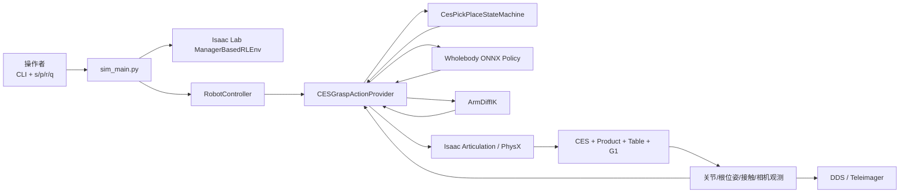
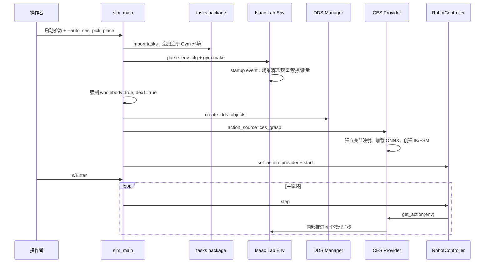
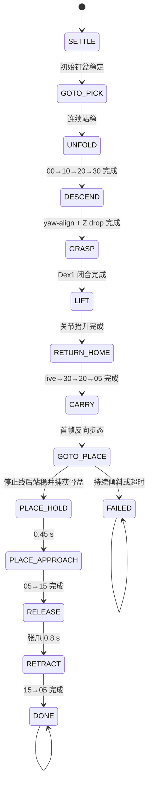
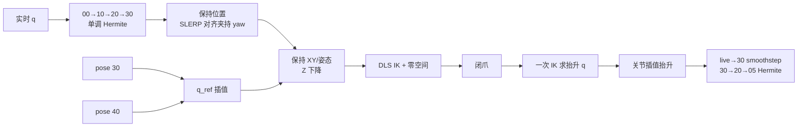
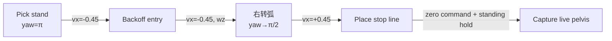

# CES 抓取任务架构设计

> 本文描述当前唯一 Smooth V1 + Wholebody Walk + 完整 Place Baseline。完整链路已通过 Isaac Sim 验证，除明确的安全缺陷修复外不再直接改动。

## 1. 架构目标

CES 任务的目标不是做一个通用机器人框架，而是在固定 CES LoadingLine 场景中可靠完成：

1. G1 右臂展开到上料托盘；
2. 用 TCP 全位姿 IK 对准并抓住 Product；
3. 靠 Dex1 PD 与真实摩擦抬起、回收到胸前；
4. 用 Wholebody 策略持物走到包装桌；
5. 钉住实际到站骨盆，执行人工批准的放置姿态；
6. 松爪并收臂；
7. 在倾倒、超时或计算异常时停止扩散运动。

架构优先级从高到低是：

```text
不撞设备/桌面
> 不丢产品
> 控制链路确定性
> 姿态自然和速度
> 通用性
```

## 2. 系统上下文



架构上有两条闭环：

- **手臂闭环**：实时 TCP/关节状态 → FSM/IK/插值 → 关节目标 → PhysX → 新状态。
- **步态闭环**：实时骨盆状态 → 固定路线规划器 → 机体系命令 → Wholebody 策略 → 腿关节目标 → PhysX → 新骨盆状态。

## 3. 分层架构

| 层 | 组件 | 职责 |
|---|---|---|
| 启动与编排 | `sim_main.py`、`RobotController` | 创建环境/DDS/动作源，运行主循环，人工暂停与 reset |
| 任务与场景 | CES task cfg、scene cfg、MDP | 注册 Gym 任务，加载 USD，配置机器人/相机/物理/奖励/终止 |
| 行为决策 | `CesPickPlaceStateMachine` + 3 个 mixin | 决定当前阶段和本帧互斥控制命令 |
| 运动生成 | `interpolation.py`、`ik_solver.py`、`navigation.py` | 生成关节轨迹、TCP IK 目标、机体系步态命令 |
| 动作仲裁 | `CESGraspActionProvider` | 在步态、右臂、左臂、腰、夹爪和 root pin 之间分配控制权 |
| 策略适配 | `DDSRLActionProvider` | 构造 10 帧策略观测、执行 ONNX、动作延迟与默认偏置 |
| 物理执行 | Isaac Lab Articulation/PhysX | PD、接触、摩擦、刚体、传感器和积分 |
| 外部可观测 | DDS、相机共享内存、日志 | 发布状态、奖励、图像和诊断；不参与当前抓取闭环 |

## 4. 启动架构



`tasks/__init__.py` 会递归导入任务包；CES 任务子包在 `gym.register()` 中把 task ID 映射到 `MoveCESProductG129Dex1WholebodyEnvCfg`。

一个关键约束是：CES provider 的 `get_action()` 自己推进仿真，所以 `control_config.use_rl_action_mode=True` 时，外层 `RobotController.step()` 不再调用 `env.step(action)`。这是避免双重积分的架构契约。

## 5. 状态机架构



`state_machine.py` 是公共门面，不实现每个阶段的细节；阶段处理器分到：

- `CesPickMixin`：`SETTLE` 至 `RETURN_HOME`；
- `CesWalkMixin`：`CARRY`、`GOTO_PLACE` 和放置钉盆上下文；
- `CesPlaceMixin`：`PLACE_HOLD` 至 `FAILED`。

三个 mixin 共享同一个实例状态，避免跨控制器同步轨迹、计时器和缓存。

Place 阶段还有一条独立安全约束：`_log_place_result()` 只负责诊断，内部任何采样、计算或格式化异常都不得阻断 RELEASE→RETRACT→DONE；若 Place 阶段仍有未预期异常，`step()` 的兜底命令必须继续携带 `_place_lock_pose`，不能解除到站骨盆固定。

## 6. 单帧命令协议

FSM 不直接操作 Isaac Sim。它只输出 `CesCommand`：

```text
CesCommand
├── gripper: float
├── walk: (vx, vy, wz, height) | None
├── root_pin: ((x,y,z), (w,x,y,z)) | None
├── arm_q: Tensor[7] | None
├── tcp_pos: Tensor[N,3] | None
├── tcp_quat: Tensor[N,4] | None
└── arm_q_ref: Tensor[7] | None
```

右臂控制互斥规则：

1. `arm_q` 非空：执行批准的关节轨迹。
2. 否则 `tcp_pos` 非空：执行全位姿 IK，可选 `arm_q_ref`。
3. 否则已经夹持：保持上次右臂目标。
4. 否则：回默认右臂姿态。

因此 `arm_q_ref` 没有独立执行权，它只能附着在 TCP IK 上。

## 7. 控制权矩阵

| 阶段组 | 骨盆/腿 | 右臂 | 左臂 | Dex1 右爪 | Product |
|---|---|---|---|---|---|
| SETTLE/GOTO_PICK | 初始 root pin | 默认/保持 | 默认 | 张开 PD | 自由刚体 |
| UNFOLD | 初始 root pin | 关节路点；未夹持时可运动学锁臂 | 默认 | 张开 PD | 自由刚体 |
| DESCEND | 初始 root pin | TCP IK + 40 q_ref | 默认 | 张开 PD | 自由刚体 |
| GRASP/LIFT/RETURN | 初始 root pin | 关节轨迹 + PD | 默认 | 闭合 PD | 摩擦跟随 |
| CARRY/GOTO_PLACE | Wholebody policy | 保持 carry q + 慢限速 | 默认 | 闭合 PD | 摩擦跟随 |
| PLACE_HOLD/APPROACH | live root pin | 05→15 + PD | 默认 | 闭合 PD | 摩擦跟随 |
| RELEASE/RETRACT/DONE | live root pin | 15 保持/15→05 | 默认 | 张开 PD | 自由刚体 |

设计中只允许双臂在未夹持时用 `write_joint_state_to_sim()` 做运动学锁定。夹持后必须通过 PD 目标执行；否则直接改关节状态会让指垫瞬移穿过或离开 Product。

## 8. 轨迹数据架构

`trajectory_manifest.json` 是 q 和路径的唯一真源：

```text
schema_version = 2
joint_order = 右臂七关节固定名字
poses = 00, 10, 20, 30, 40, 05, 15
forward_path = 00→10→20→30, Hermite
q_ref = 30→40
return_path = 40→30→20→05, Hermite 声明
place_path = 05→15, smoothstep
```

运行时对 return 做一次有意的拆分：

- 第一个清单点 40 只表示“实时抬升结束姿态的语义位置”；
- `live→30` 强制用单段 smoothstep；
- `30→20→05` 才按 manifest 的 Hermite 执行。

`pose_library.py` 验证：

- schema/name；
- `joint_order` 与运行时右臂关节名完全一致；
- 每组 q 都是 7 维；
- 每条路径的时长数等于路点数减一；
- 时长为正且插值方法受支持；
- forward 末点、q_ref、return 起点之间合约一致；
- return 末点等于 place 起点；
- 路径引用的 pose 全部存在。

这使错误在启动期失败，而不是在抓取中途才暴露。

## 9. 坐标系架构

### 9.1 使用的坐标系

| 坐标系 | 记号 | 用途 |
|---|---|---|
| 世界系 | $W$ | 场景资产、Product AABB、骨盆、TCP 目标 |
| 机器人基座系 | $B$ | IK 误差和雅可比求解 |
| 机器人机体系二维命令 | body XY/yaw | Wholebody `[vx,vy,wz,height]` |
| 末端刚体系 | EE | `right_hand_base_link` |
| TCP 局部点 | TCP | EE 局部 `(0,0.115,0)` |

### 9.2 变换关系

世界目标经 `subtract_frame_transforms()` 转到基座系：

$$
{}^B\mathbf p={}^BR_W({}^W\mathbf p-{}^W\mathbf p_B)
$$

TCP 世界位置：

$$
{}^W\mathbf p_{tcp}={}^W\mathbf p_{ee}+{}^WR_{ee}\,{}^{ee}\mathbf r_{tcp}
$$

机体系速度到世界速度的启动 kick：

$$
\begin{bmatrix}v_x^W\\v_y^W\end{bmatrix}
=
\begin{bmatrix}
\cos\psi&-\sin\psi\\
\sin\psi&\cos\psi
\end{bmatrix}
\begin{bmatrix}v_x^B\\0\end{bmatrix}
$$

### 9.3 为什么抓取与 Place 的坐标策略不同

- Pick 的最终 Product 位置会有仿真偏差，所以使用 AABB + 世界 TCP IK。
- Place 的 Baseline 是人工 pose 15；用户接受不追世界 XY，因此到站后只锁真实骨盆并走关节轨迹。
- 二者不能混写成“都由笛卡尔 IK 完成”。

## 10. 手臂运动架构



为什么抬升只求一次 IK：夹住 Product 后如果每个控制帧重新求 IK，线性化、接触力和观测微小变化会让关节目标抖动；先求一个 q_lift，再走确定的关节插值，能让摩擦夹持更稳定。

## 11. DLS IK 架构

IK 输入：

- 世界 TCP 位置和四元数；
- 当前机器人 root pose；
- 当前 TCP pose；
- 右臂 7 关节雅可比；
- 可选 q_ref。

任务误差加权：位置权重 1.0、姿态权重 0.45。阻尼默认 0.08，单内部迭代关节变化限制 0.03 rad，最多 8 次线性更新，位置容差 5 mm。

计算：

$$
\Delta q=J_w^T(J_wJ_w^T+\lambda^2I)^{-1}e
+(I-J_w^+J_w)k(q_{ref}-q)
$$

然后：

$$
\Delta q\leftarrow\operatorname{clip}(g\Delta q,-\Delta q_{max},\Delta q_{max})
$$

$$
q\leftarrow\operatorname{clip}(q+\Delta q,q_{min},q_{max})
$$

同一物理帧的内部迭代不重新读取 PhysX 位姿和 Jacobian，只用一阶关系更新误差：

$$
e\leftarrow e-J\Delta q
$$

这是性能与精确重线性化之间的明确折中。

## 12. Wholebody 步态架构

### 12.1 策略观测

单帧观测：

$$
o_t=[\omega_b,g_b,c_t,q-q_0,\dot q-\dot q_0,a_{t-d}]
$$

其中：

- $\omega_b$：基座角速度；
- $g_b$：机体系投影重力；
- $c_t=[v_x,v_y,\omega_z,h]$；
- q/速度包含腿和双臂相关关节；
- $a_{t-d}$ 来自延迟动作缓冲。

10 帧观测堆叠后输入 ONNX 策略。策略腿部输出经过 5 帧延迟、裁剪和默认偏置：

$$
q_{leg}^{target}=q_{leg}^{default}+0.25\,\operatorname{clip}(a_{delay},-100,100)
$$

### 12.2 Pick→Walk 交接

Pick 阶段的 10 帧历史全是站立命令。如果直接释放 root pin，策略会把当前状态理解成“仍应站立”，容易向 CES 收集一两步。因此交接时：

1. 清空 10 帧观测历史；
2. 清空 5 帧动作延迟历史；
3. 用反向命令预载滤波；
4. 给骨盆和已夹持 Product 相同的反向世界速度 kick；
5. 第一帧直接跨过 `vx` 死区。

### 12.3 路线规划



路线是由抓取站后退线与放置站进站线的交点构造。理论角点再减去转弧 lead，避免转弧期间继续后退导致越过进站线。

最终到站以停止线为最高优先级。即便侧向或 yaw 还没完全进入报告窗口，也不能越线继续纠偏。

## 13. Root pin 与物理接触架构

### 13.1 Pick pin

从 `SETTLE` 到 `RETURN_HOME`，每个 0.005 s 物理子步：

$$
x_{root}\leftarrow x_{scene\_init},\qquad
q_{root}\leftarrow q_{scene\_init},\qquad
v_{root}\leftarrow0
$$

Product 不随 root pin 移动。

### 13.2 Place pin

导航到站并站稳后捕获：

$$
T_{lock}=T_{root}^{live}
$$

后续 PLACE_HOLD 至 DONE 每个物理子步重复写回 $T_{lock}$。这里保留完整 live 四元数，不只保留 yaw。

### 13.3 Product

- Pick/Walk 期间不焊 TCP；
- Walk 开始时 Product 只得到一次与骨盆相同的速度 kick；
- Walk→Pin 只把 Product 速度清零一次；
- 不直接改 Product pose；
- 之后由重力、接触和摩擦决定运动。

这保证“夹住”仍是物理结果，而不是脚本搬运。

## 14. 安全架构

| 风险 | 检测/保护 | 结果 |
|---|---|---|
| 初始未站稳 | tilt、yaw rate、XY speed、root Z | 等待；6 s 超时放行手臂 |
| 下降 IK 异常 | provider/FSM 异常捕获 | 保持上次 q，限频记录错误 |
| 40 被硬下发 | DESCEND 中检测 `arm_q` | 记录验证错误；正常路径不会产生 |
| 关节目标阶跃 | IK 内限幅 + provider `_slew_arm` | 每控制周期限制 dq |
| 步态不起步 | 首帧预载、历史清空、速度 kick | 直接跨死区后退 |
| 行走倾倒 | tilt > 0.55 持续 0.40 s | `FAILED`、步态归零、保持闭爪 |
| 行走卡住 | 60 s 超时 | `FAILED` |
| 转弧不响应 | 漂移 > 0.70 m | 反向平移并提高到 `wz=1.55` |
| 接近桌面过头 | 独立 keep-out 闩锁 | 永久步态归零，从当前位置放置 |
| 到站余晃 | 站稳 hold + live root pin | 固定实际骨盆再放置 |
| 持物突降 | Product Z 相对下降 > 0.05 m | 每轮至多告警一次，不打断流程 |
| Place 结果诊断异常 | `_log_place_result()` 内部隔离 | 仅丢失日志，RELEASE→RETRACT→DONE 继续执行 |
| 任意 FSM 异常 | `step()` 顶层捕获 | 返回不扩散运动的安全命令；Place 阶段保留 live root pin |

keep-out 与导航器独立，避免某个规划分支遗漏停止条件时继续撞桌。

## 15. 奖励、终止与 FSM 成功的关系

奖励是离散诊断：

$$
r=
\begin{cases}
-1,&z<z_{drop}\\
1,&(x,y,z)\in\text{包装桌有效盒}\\
0,&\text{其他}
\end{cases}
$$

终止条件：

$$
done=(z<z_{drop}),\quad z_{drop}=0.32\text{ m}
$$

注意：

- 奖励的 `+1` 是“在包装桌有效区域”，不是精确灰筐内判定；
- FSM 的 `DONE` 是流程结束，不读取奖励；
- Product 落点日志只用于 DEBUG；
- 这套任务目前更像确定性自动化验收环境，而不是用该奖励训练 CES 策略。

## 16. 数据与配置所有权

| 数据 | 唯一真源 | 修改原则 |
|---|---|---|
| 00/10/20/30/40/05/15 q | `trajectory_manifest.json` | 人工 pose 必须先预览、批准；代码整理不得改 q |
| 路径/时长/插值 | 同一 manifest | 改后校验路径合约和速度缩放 |
| 抓取/步态/安全阈值 | `constants.py` | 必须说明物理依据并做仿真验收 |
| CES/Product/桌/灰筐几何 | scene cfg + USD | 当前 scene cfg 直接写最终世界坐标；场景改动会影响站位、路线和碰撞 |
| G1 执行器基础配置 | `robots/unitree.py` | Dex1 的 CES 运行值会被 provider 再覆盖 |
| 物理 dt/episode/地面摩擦 | env cfg | 必须保持 provider decimation 一致 |
| Product/Pad/Tray 摩擦与质量 | `tune_product_grasp_physics()` | 属于已验证 Baseline，不应随意统一 |

## 17. 架构中明确删除的旧方案

当前代码不再支持：

- `ces_pick_natural_v1/v2` 运行回退；
- `--ces_waypoint_set` 等多路点集选择；
- station snap/瞬移换站；
- 通用任意路段导航器；
- Z-only Place IK；
- Place 笛卡尔 XY 目标和 pose 25；
- 产品位姿跟随/焊接 TCP；
- 通用 `manip_common` CES 抽象；
- 无效的 CES 抽屉运行时改色钩子。

历史文档或旧 Memory 中若出现这些名字，应视为开发演进记录，不是当前 API。

## 18. 质量属性与权衡

### 确定性

- 单 manifest、单路线、单状态机；
- 人工 q 与固定时长；
- 抓取起始骨盆和放置到站骨盆都 pin；
- 每控制帧固定 4 个物理子步。

代价是场景迁移能力弱。

### 物理真实性

- Product 不焊接、不搬 pose；
- Dex1 用 PD 和摩擦；
- 步态由 ONNX 策略执行。

代价是对摩擦、接触、滑行和策略死区敏感。

### 可维护性

- FSM 按 Pick/Walk/Place 拆分；
- 插值、IK、导航独立；
- manifest 启动期严格校验；
- 上下文接口隔离 FSM 与 Isaac 内部对象。

当前缺口是重构后没有长期保留的 CES 自动化测试。

### 性能

- 缓存 Tensor、索引、动作缓冲；
- 策略观测 10 帧复用；
- IK 同帧不重复读 PhysX/Jacobian；
- 抬升只求一次 IK。

代价是 IK 多次内部迭代只做一阶误差更新，极端非线性区域仍依赖下一控制帧纠正。

## 19. 推荐的扩展点

Fix Baseline 的冻结边界包括 `GRASP_Z_CLEARANCE=0.022`、`GRASP_SHIFT_Y=0.0`、`TCP_LOCAL=(0,0.115,0)`、现有人工 q、路线和物理参数。深夹到 0.007 的方案已因指垫穿入 Product 凹槽被否决，世界 `-Y` 横移实验也未可靠避障；二者都不是可恢复的 Baseline 选项。

若未来扩展而不破坏 Baseline，建议沿以下接口：

1. 新的 Product 定位器：实现与 `get_product_aabb_center_w()` 相同的世界坐标输出，可由 CV 替换，但不要直接改 FSM。
2. 新轨迹版本：新建独立 manifest/schema 或任务 ID，不要静默改当前人工 q。
3. 新导航器：保持输出 `CarryWalkStep`/四维机体系命令和 stop-line 安全语义。
4. 新 IK：保持 `solve(target_pos_w, target_quat_w, q_ref)` 合约，并验证 q_ref 只在零空间。
5. 精确入筐验收：新增独立几何判定，不要把现有粗粒度奖励偷偷改成另一种含义。
6. 长期测试：给纯数学模块和 manifest 合约恢复可常驻 CPU 测试，物理验收仍单独保留。

新抓取几何、回缩防滑或场景适配应建立独立任务、分支或 manifest，并完成静态、轨迹和 Isaac Sim 物理验收后再决定是否形成新的版本化 Baseline，不能覆盖当前固定值。

## 20. 数学设计如何落到架构

这一节从架构角度解释：为什么同一个 CES 任务里会同时出现固定世界坐标、机体系步态、关节 Hermite、笛卡尔 smoothstep、四元数 SLERP 和 DLS IK。大白话说，它们分别解决不同层的问题，不能混成一种“万能插值”。

### 20.1 场景层：直接世界坐标，不再运行时推导

当前 scene cfg 把 CES、Product、机器人、包装桌和灰筐都写成最终世界坐标。这样做牺牲了一点“改一处自动推一片”的灵活性，但换来了维护优势：后续开发者打开文件就能看到真实生成点。

旋转仍然只保留最基础的 yaw 四元数：

$$
q_z(\psi)=
\left(\cos\frac{\psi}{2},0,0,\sin\frac{\psi}{2}\right)
$$

这对应 `_yaw_quat(deg)`。它只负责把人能读懂的角度转成 Isaac 需要的 `wxyz`，不再承担“簇中心旋转”“站位反算”等隐藏几何。

### 20.2 步态层：机体系命令先于世界系理解

Wholebody 策略吃的是机体系命令：

$$
\mathbf u_b=(v_x^b,v_y^b,\omega_z,h)
$$

只有当需要解释世界运动、首帧速度 kick 或导航误差时，才把机体系前向旋到世界系：

$$
\begin{bmatrix}v_x^w\\v_y^w\end{bmatrix}
=
\begin{bmatrix}
\cos\psi&-\sin\psi\\
\sin\psi&\cos\psi
\end{bmatrix}
\begin{bmatrix}v_x^b\\v_y^b\end{bmatrix}
$$

CES 抓取站 yaw 为 $\pi$，所以 $v_x^b>0$ 在世界里是 $-X$，$v_x^b<0$ 在世界里是 $+X$。这就是为什么 CARRY 第一帧要发 `vx=-0.45`：它不是“往机体系后退”这个词本身重要，而是在当前 yaw 下能让机器人从 CES 前方退出。

### 20.3 轨迹层：单段 smoothstep，多点 Hermite

单段动作只需要起点、终点和“别突然冲出去”，所以用 smoothstep：

$$
s(\tau)=3\tau^2-2\tau^3
$$

它由四个边界条件推得：

$$
s(0)=0,\quad s(1)=1,\quad s'(0)=0,\quad s'(1)=0
$$

多路点动作不能每段都独立起停，否则 00→10→20→30 会在每个中间路点停顿。Hermite 额外保存路点速度：

$$
q(\tau)=h_{00}q_i+h_{10}T_im_i+h_{01}q_{i+1}+h_{11}T_im_{i+1}
$$

中间速度 $m_i$ 用相邻割线同号时的加权调和平均，不同号置零。这让每个关节在人工路点之间保持局部形状，避免为了连续速度而穿出人工设计的姿态范围。

因此架构上把二者都保留：`segment_smoothstep` 适合 live→30、05→15、15→05、闭爪和笛卡尔分段；`monotone_cubic_hermite` 适合 00→10→20→30 和 30→20→05 这种多路点通道。

### 20.4 姿态层：四元数走球面，不按四个数硬 lerp

姿态四元数是单位四维向量，合法姿态在单位球面上。若直接对四个分量线性插值，会先离开单位球面，再归一化回去，角速度和路径都不稳定。SLERP 使用球面大圆：

$$
q(h)=
\frac{\sin((1-h)\Omega)}{\sin\Omega}q_0+
\frac{\sin(h\Omega)}{\sin\Omega}q_1,\quad
\cos\Omega=q_0\cdot q_1
$$

CES 的姿态插值由 `CartesianInterpolator` 调 Isaac Lab `quat_slerp` 完成，外层用 smoothstep 生成 $h$。这表示路径仍是球面最短姿态弧，但时间上会慢起慢停。

### 20.5 IK 层：DLS 解 6D TCP，q_ref 只管冗余

右臂 7 自由度，TCP 任务 6 维。线性化关系是：

$$
\mathbf e\approx J\Delta q
$$

为了在奇异位形附近不炸关节速度，DLS 解的是：

$$
\min_{\Delta q}\|J_w\Delta q-\mathbf e\|^2+\lambda^2\|\Delta q\|^2
$$

得到：

$$
\Delta q=J_w^T(J_wJ_w^T+\lambda^2I)^{-1}\mathbf e
$$

pose 40 不作为 `arm_q`，只作为零空间参考：

$$
\Delta q_{null}=(I-J^+J)k(q_{40}-q)
$$

这样 TCP 主任务优先，冗余关节才向人工姿态靠近。架构上因此把 `arm_q` 和 `arm_q_ref` 明确分开：前者有执行权，后者只有在 TCP IK 命令里才生效。

### 20.6 TCP 层：偏移点雅可比不能直接用 EE 原点

Dex1 真正夹持点不是 `right_hand_base_link` 原点，而是局部偏移 `TCP_LOCAL=(0,0.115,0)`。刚体上一点的速度：

$$
v_{tcp}=v_{ee}+\omega\times r
$$

用反对称矩阵写成：

$$
[r]_\times=
\begin{bmatrix}
0&-r_z&r_y\\
r_z&0&-r_x\\
-r_y&r_x&0
\end{bmatrix},\qquad
\omega\times r=-[r]_\times\omega
$$

所以：

$$
J_{v,tcp}=J_{v,ee}-[r]_\times J_\omega
$$

这就是 `ArmDiffIK._jacobian_b()` 保留为 CES 专用实现的关键原因之一：通用 IK 控制器未必保留这个 TCP 偏移、动态 q_ref、权重、限幅和当前 50 Hz 控制契约。

## 21. 关联文档

- [01_CES开发说明.md](01_CES开发说明.md)：开发时间线、当前阶段行为、数学基础和验证方法。
- [03_CES模块设计与核心代码解析.md](03_CES模块设计与核心代码解析.md)：逐文件逐函数职责与核心代码解读。
