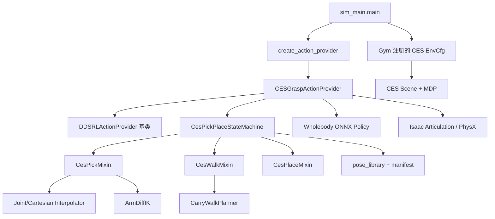

# CES 模块设计与核心代码解析

> 代码口径：`main@69bf52a` Baseline + 当前工作区坐标/注释简化
> 目标：解释 CES 相关文件、类、函数、调用关系、输入输出、数学含义与设计约束。

## 1. 覆盖范围

“相关文件”按两层定义，避免把整个 Isaac Lab 和所有通用任务都机械抄进来：

- **A 层：CES 专用文件**。逐文件、逐类、逐函数全部说明。
- **B 层：CES 运行必经的通用桥接文件**。逐一说明 CES 调用到的函数；与 CES 无关的 Dex3/Inspire/Replay 分支只交代边界。

A 层包括：

```text
action_provider/action_provider_ces_grasp.py
action_provider/ces_grasp/*.py
action_provider/ces_grasp/poses/ces_pick_smooth_v1/trajectory_manifest.json
tasks/common_scene/base_scene_ces_pickplace_wholebody.py
tasks/g1_tasks/move_ces_product_g1_29dof_dex1_wholebody/**
```

B 层包括：

```text
sim_main.py
action_provider/create_action_provider.py
action_provider/action_base.py
action_provider/action_provider_wh_dds.py
layeredcontrol/robot_control_system.py
tasks/__init__.py + tasks/utils/importer.py
tasks/common_config/{robot_configs,camera_configs}.py
tasks/common_observations/{g1_29dof_state,gripper_state,camera_state}.py
tasks/common_event/event_manager.py
dds/dds_create.py
robots/unitree.py
```

## 2. 总调用图



一次控制帧的核心调用顺序：

```text
RobotController.step
└── CESGraspActionProvider.get_action
    ├── fsm.step
    │   └── 当前 _step_xxx → CesCommand
    ├── _resolve_walk_policy
    ├── _compose_joint_targets
    │   └── _right_arm_target → arm_q 或 ArmDiffIK.solve
    ├── _finalize_action
    └── _advance_simulation × 4 physics substeps
```

## 3. `action_provider/ces_grasp/__init__.py`

职责：定义 CES 包的公共 API。它重新导出状态机、top-down 姿态函数，以及 TCP、夹爪、站位常量。该文件没有函数，`__all__` 用来防止外部模块依赖内部实现细节。

## 4. `constants.py`

职责：保存 Baseline 数值、关节名、物理时序、导航参数，并把抓取站、放置站和固定路线集中成一处可读配置。

| 分组 | 代表变量 | 含义 |
|---|---|---|
| 手臂/夹爪 | `TCP_LOCAL`、`EE_BODY`、`RIGHT_ARM_JOINTS` | IK 与关节映射契约 |
| 抓取几何 | `LIFT_HEIGHT`、`GRASP_INSET`、`GRASP_Z_OFFSET` | AABB 抓取点和抬升 |
| 状态时序 | `SETTLE_TIME`、`DESCEND_TIME`、`GRASP_TIME` | FSM 门槛 |
| 手臂保护 | `ARM_SLEW_RAD`、`PICK_SEGMENT_MIN_TIME` | 目标变化量和最短段 |
| Dex1 | `DEX1_STIFFNESS/DAMPING/EFFORT_LIMIT` | PD 与力矩上限 |
| 步态 | `WALK_VX/VY/WZ`、各种容差 | 固定幅值、迟滞、保护 |
| 场景坐标 | `PICK_ROOT_PIN`、`PLACE_STAND_XY`、`PLACE_TARGET_XY` | 固定站位、放置目标和 root pin |
| 路线对象 | `CARRY_WALK_CONFIG/ROUTE` | 导航器只读输入 |

### `clamp_pick_speed(scale)`

把速度倍率限制到 `[0.25, 3.0]`；`None` 使用 1.5：

$$s_{safe}=\min(3.0,\max(0.25,s))$$

### `forward_left(yaw)`

返回机器人前向和左向的世界二维单位向量：

$$\mathbf f=(\cos\psi,\sin\psi),\quad \mathbf l=(-\sin\psi,\cos\psi)$$

它来自二维旋转矩阵：

$$
R_z(\psi)=
\begin{bmatrix}
\cos\psi&-\sin\psi\\
\sin\psi&\cos\psi
\end{bmatrix}
$$

矩阵第一列就是机体系 $+X$ 轴在世界系的方向，第二列就是机体系 $+Y$ 轴在世界系的方向。代码返回 `(fwd,left)`，后续 `_into_drawer()`、`_kick_walk_start_velocity()` 和导航误差投影都复用同一套方向定义，避免“世界 +X”和“机器人前方”混用。

当前抓取站直接取场景里的机器人初始 XY：

```text
PICK_STAND_XY = (ROBOT_INIT_POS[0], ROBOT_INIT_POS[1])
```

放置站直接写最终世界坐标：

```text
PLACE_STAND_XY = (-2.2669, -0.7717)
```

模块加载时调用 `build_carry_route()`，把抓取站与放置站变成唯一 `CarryRoute`。历史上曾用辅助函数反算站位；当前为了降低维护成本，已改成直接常量。

## 5. `fsm_types.py`

### `RootPose` / `WalkCommand`

前者是 `((x,y,z), (w,x,y,z))`；后者是 `(vx,vy,wz,height)` 机体系策略命令。

### `CesPickPlacePhase`

枚举 15 个运行/终止阶段，是 `_PHASE_HANDLERS` 的键。

### `CesCommand`

状态机到动作提供器的单帧数据类。约束是：

- `arm_q` 与 `tcp_pos/tcp_quat` 语义互斥；
- `arm_q_ref` 只与 TCP IK 一起使用；
- `root_pin=None` 才允许真实步态；
- `gripper` 每帧必有值。

TYPE_CHECKING 分支把 `Tensor` 在无 PyTorch 环境下退化成 `Any`，使纯类型模块可轻量导入。

## 6. `pose_library.py`

### `CesTrajectory`

冻结数据类，保存 pose 映射、forward/return/place 路点和时长、插值方法与 q_ref 桥接点。

### `_path(data, name)`

读取一个路径对象并验证：路点至少两个、时长数等于路点数减一、时长为正、方法属于 smoothstep/Hermite。返回 `(waypoints,durations,method)`。

### `load_baseline_trajectory()`

完整启动期校验器：

1. JSON 必须是 schema 2 和 `ces_pick_smooth_v1`；
2. `joint_order` 必须逐项等于 `RIGHT_ARM_JOINTS`；
3. 每个 q 必须是 7 维；
4. 调用 `_path()` 解析三条路径；
5. q_ref `from` 等于 forward 末点；
6. q_ref `to` 等于 return 起点；
7. return 末点等于 place 起点；
8. 所有引用 pose 存在；
9. 构造运行数据。

这防止 JSON 数组按 DDS 下标误解释；q 始终依照清单关节名顺序。

## 7. `state_machine.py`

### `CesPickPlaceStateMachine.__init__(ctx, speed_scale)`

保存 provider 上下文；创建两类插值器；加载 manifest；把所有 pose 预转为设备 Tensor；计算速度缩放后的 forward/return/place/lead-in/lift 时长。`ctx` 是窄接口，FSM 不直接访问 `env.scene`。

### `_scaled(durations, min_time=0)`

调用 `scale_segment_times()`：

$$T'_i=\max(T_{min},T_i/s)$$

### `reset()` / `_reset_runtime()`

`reset()` 是公开入口。后者清空一次任务的 phase、计时、夹爪、抓取/携带/放置 q、30/40、return follow-up、插值、planner 诊断、keep-out、live place root、掉落监视和错误节流。

### `_transition(phase)`

记录阶段变化，清零 `t/hold`。进入 `GOTO_PLACE` 时重置 planner 和行走诊断，避免新任务继承旧状态。

### `_cmd(...)`

集中构造 `CesCommand`。Pick 前半程未给 walk/root_pin 时自动补 `PICK_ROOT_PIN`。夹爪值再由 `_squeezing()` 强制仲裁。

### `_squeezing()`

判断是否必须闭爪。`FAILED` 仅在 `_carry_arm_q` 已存在时继续闭爪。

### `step()`

每帧累加控制 dt，按 `_PHASE_HANDLERS` 反射调用当前 `_step_xxx`。异常每 2 s 最多记录一次，并返回步态归零/保持当前手臂的安全命令。

## 8. `fsm_pick.py`

### `top_down_grasp_quat(jaw_axis_w)`

把夹持轴水平归一化为 $\mathbf x$，令手指向下 $\mathbf d=(0,0,-1)$：

$$\mathbf z=\frac{\mathbf x\times\mathbf d}{\|\mathbf x\times\mathbf d\|},\qquad \mathbf y=\mathbf z\times\mathbf x$$

以 $R=[\mathbf x\ \mathbf y\ \mathbf z]$ 转四元数。

这里的代码思路是“先搭一个正交坐标架，再转四元数”。`jaw_axis_w` 决定手掌局部 $+X$ 指向哪里；手指朝下相当于把一个参考方向固定到世界 $-Z$。先算 $\mathbf z=\mathbf x\times\mathbf d$，再算 $\mathbf y=\mathbf z\times\mathbf x$，可以保证三个轴互相垂直并满足右手系。最后 `quat_from_matrix()` 把这个旋转矩阵转成 Isaac 使用的四元数。

### `CesPickMixin` 全部方法

| 方法 | 作用 |
|---|---|
| `_offset_z(pos,dz)` | clone 位置并只改 Z，防止污染缓存 |
| `_into_drawer(pos,dist)` | $p'=p+d f(\psi_{pick})$；当前正 dist 为世界 -X |
| `_plan_grasp()` | 用 Product AABB 中心 + inset/Z clearance 生成抓取点和 top-down 姿态 |
| `_at_pick_stand()` | 至少等待门槛并累计连续站稳；6 s 超时放行 |
| `_start_grasp(err)` | 冻结实时 TCP 与右臂 q，限制 Z 不低于计划值，转 GRASP |
| `_begin_joint_lift()` | 只求一次抬升 IK，再建 q_now→q_lift 关节轨迹 |
| `_begin_return_home()` | 建 live→30 smoothstep，并缓存 30→20→05 Hermite |
| `_hand_jaw_yaw(quat_w)` | 把局部 X 轴旋到世界，返回 $atan2(j_y,j_x)$ |
| `_yaw_align_grasp_quat(live_quat)` | 选择最近世界 ±X，左乘世界 Z 增量四元数 |
| `_begin_descend()` | 构造“原地转 yaw → 保持 XY/姿态降 Z”三点路径 |
| `_handoff_cmd()` | UNFOLD 完成帧立即给第一条笛卡尔命令，避免空帧 |
| `_q_ref_for_descend()` | 对齐期 q30；下降期 smoothstep 插到 q40；只供零空间 |
| `_pose_q(name)` | 从设备 Tensor 缓存取姿态 |
| `_start_joint_waypoints()` | 装 00→10→20→30；与 00 差大时增加实时 lead-in |
| `_step_settle()` | 钉盆张爪，稳定后规划抓取并转 GOTO_PICK |
| `_step_goto_pick()` | 连续站稳后转 UNFOLD |
| `_step_unfold()` | 推进 joint path，完成帧直接 handoff DESCEND |
| `_step_descend()` | 推进位置/SLERP、计算 q_ref，完成/超时后闭爪 |
| `_step_grasp()` | smoothstep 闭爪并保持实时抓取 q，0.6 s 后抬升 |
| `_step_lift()` | 执行一次性 IK 得到的 q 轨迹，完成后启动 return |
| `_step_return_home()` | 先 live→30，再 30→20→05，完成后转 CARRY |

抓取点公式：

$$\mathbf p_g=\mathbf p_{aabb}+0.020\mathbf f(\pi)+(0,0,0.01275+0.022)$$

抬升目标：

$$\mathbf p_{lift}=\mathbf p_g+(0,-0.06,0.08)$$

下降 q_ref：

$$q_{ref}(s)=\operatorname{lerp}(q_{30},q_{40},3s^2-2s^3)$$

## 9. `fsm_walk.py`

### `CesWalkMixin` 全部方法

| 方法 | 作用 |
|---|---|
| `_walk_planner()` | 延迟创建固定 route/config 的 planner |
| `_guide_route()` | 读实时 x/y/yaw、执行 planner、写阶段诊断、检查 keep-out、累计站稳 |
| `_table_keepout_hit(x,y)` | 沿 place 前向算越线量；命中后永久闩锁 |
| `_brake_for_table(x,y)` | 永久归零步态，站稳后允许从当前位置 Place |
| `_walk_to_place()` | 组合路线、倾倒保护、60 s 超时 |
| `_place_body_cmd(**kwargs)` | 强制用捕获的 live place root pin 构造命令 |
| `_watch_carry_drop(where)` | Product 相对 Z 下降超过 0.05 m 时每轮告警一次 |
| `_step_carry()` | 首帧预载并立即下发 `(-0.45,0,0,0.8)` |
| `_step_goto_place()` | 持物导航；到站捕获 root pos/完整 quat、实时臂 q 和 Product Z0 |

keep-out 越线量：

$$p=(\mathbf x-\mathbf x_{stand})\cdot\mathbf f(\psi_{place})$$

触发条件：

$$p>0.02-0.06=-0.04\text{ m}$$

## 10. `fsm_place.py`

### `CesPlaceMixin` 全部方法

| 方法 | 作用 |
|---|---|
| `_frozen_place_arm()` | 惰性捕获/返回 pose 15 保持 q |
| `_begin_place_approach()` | 以 live q 为起点装载 05→15，并记录 $\|q_{live}-q_{05}\|_\infty$ |
| `_begin_retract()` | 以 live 15 回 `_carry_arm_q`/05，总时长 3.2 s |
| `_log_place_result(tag)` | 记录 Product 到筐中心 dxy 和相对筐顶高度，不参与控制 |
| `_step_place_hold()` | 钉 live 骨盆、闭爪、保持 05 共 0.45 s |
| `_step_place_approach()` | 钉盆执行 05→15，完成后 RELEASE |
| `_step_release()` | 张爪保持 15；0.8 s 后开始 15→05 |
| `_step_retract()` | 张爪执行 15→05，完成后 DONE |
| `_step_done()` | 持续钉盆并保持最终 05 |
| `_step_failed()` | 步态归零；已抓到则闭爪保持 carry q |

落点平面诊断：

$$d_{xy}=\sqrt{(x-x_t)^2+(y-y_t)^2}$$

## 11. `grasp_yaw.py`

### `wrap_pi(rad)`

$$\operatorname{wrap}(\theta)=((\theta+\pi)\bmod2\pi)-\pi$$

输出 `[-π,π)`。

### `jaw_xy_yaw(jx,jy)`

返回 $\psi=\operatorname{atan2}(j_y,j_x)$。

### `closer_world_x_yaw(current_yaw)`

计算到 `+X` 的 $d_+=wrap(0-\psi)$ 和到 `-X` 的 $d_-=wrap(\pi-\psi)$，返回绝对值更小者。产品短边沿世界 X，两个方向都能夹，选择更短旋转。

## 12. `interpolation.py`

### 顶层函数

| 函数 | 作用 |
|---|---|
| `ease_in_out(value)` | 裁到 `[0,1]` 后计算 $3s^2-2s^3$ |
| `scale_segment_times(durations,scale,min_time)` | 逐段 $\max(T_{min},T/s)$ |
| `_bounds(durations)` | 时长转累计结束时刻，总时长求和；单段至少 1 ms |
| `_segment(bounds,elapsed)` | 二分查当前段，返回段号、段长、归一化进度 |
| `_quat_slerp(q0,q1,phase)` | 逐环境调用 Isaac Lab `quat_slerp` 并 stack |
| `_monotone_cubic_slopes(points,durations)` | 计算形状保持的 C1 路点斜率 |

### `ease_in_out(value)` 的推导

`ease_in_out()` 实现三次 smoothstep。它从四个边界条件来：

$$
s(0)=0,\quad s(1)=1,\quad s'(0)=0,\quad s'(1)=0
$$

设 $s(\tau)=a\tau^3+b\tau^2+c\tau+d$，代入得到：

$$
d=0,\quad c=0,\quad a+b=1,\quad 3a+2b=0
$$

所以：

$$
a=-2,\quad b=3,\quad s(\tau)=3\tau^2-2\tau^3
$$

代码写成 `value * value * (3.0 - 2.0 * value)`，和 $3\tau^2-2\tau^3$ 完全一样。它只保证位置 C1 起停平滑，不是最小 jerk，也不保证避障。

### `_bounds()` 与 `_segment()` 的时间映射

`_bounds()` 把每段时长 $T_i$ 累加成结束时间：

$$
b_i=\sum_{k=0}^{i}T_k
$$

`_segment()` 用 `bisect_left(bounds, elapsed)` 找到当前段，然后把真实时间转成该段内的归一化进度：

$$
\tau_i=
\operatorname{clip}
\left(
\frac{t-b_{i-1}}{b_i-b_{i-1}},0,1
\right)
$$

这样插值器不关心全局时间，只关心“现在落在哪一段、这一段走了多少比例”。`max(1e-3)` 和 `max(1e-6)` 是防御性写法，避免零时长导致除零。

段进度：

$$\tau=\operatorname{clip}\frac{t-t_i}{T_i}$$

Hermite 割线：

$$\delta_i=\frac{q_{i+1}-q_i}{h_i}$$

内部路点仅在相邻割线同号时用加权调和平均，否则斜率为 0；端点斜率为 0。这是逐关节分量的局部形状保持。

更具体地说，割线 $\delta_i$ 表示第 $i$ 段如果匀速通过时的速度。若 $\delta_{i-1}$ 和 $\delta_i$ 符号相反，说明该关节在路点处要换方向，斜率必须置零，否则三次曲线会穿过路点继续冲。若符号相同，说明它在同一方向运动，才用加权调和平均：

$$
m_i=
\frac{w_1+w_2}{w_1/\delta_{i-1}+w_2/\delta_i},
\quad
w_1=2h_i+h_{i-1},\quad
w_2=h_i+2h_{i-1}
$$

这类斜率比普通算术平均更保守；当一侧割线很小，结果也会被拉小，减少过冲风险。CES 按关节分量分别计算 `same_direction`，所以每个关节都独立保持形状。

### `CartesianInterpolator`

| 方法/属性 | 作用 |
|---|---|
| `__init__()` | 建空 points/quats/bounds 和计时状态 |
| `reset_path(...)` | 校验点数=段数+1、clone 输入、建累计时刻；支持逐点 quat 或 start/goal |
| `has_path` | 至少一段和两个位置点 |
| `finished` | 无路径或 elapsed 到总时长 |
| `step(dt)` | 推进时间；phase 过 smoothstep；位置 lerp、姿态 SLERP |

位置：

$$p=(1-h)p_i+hp_{i+1},\quad h=3\tau^2-2\tau^3$$

姿态部分不做普通线性插值，而是把同一个 $h$ 交给 `_quat_slerp()`。对单位四元数 $q_0,q_1$：

$$
\cos\Omega=q_0\cdot q_1
$$

$$
q(h)=
\frac{\sin((1-h)\Omega)}{\sin\Omega}q_0+
\frac{\sin(h\Omega)}{\sin\Omega}q_1
$$

这样插值始终走四元数单位球面的姿态弧。`CartesianInterpolator.step()` 因此是“位置 smoothstep lerp + 姿态 smoothstep 参数化 SLERP”的组合。

### `JointSpaceInterpolator`

| 方法/属性 | 作用 |
|---|---|
| `__init__()` | 调 `clear()` |
| `reset(start_q,goal_q,duration,method)` | 两点路径便捷接口 |
| `reset_path(qs,durations,method)` | 校验方法/数量，clone，Hermite 时预计算 slopes |
| `clear()` | 清空并恢复默认 method |
| `has_path` / `finished` | 路径有效与完成状态 |
| `step(dt)` | smoothstep 或 Hermite 求当前 q |

Hermite 源码对应：

$$q(\tau)=h_{00}q_i+h_{10}T_im_i+h_{01}q_{i+1}+h_{11}T_im_{i+1}$$

$$h_{00}=2\tau^3-3\tau^2+1,\quad h_{10}=\tau^3-2\tau^2+\tau$$

$$h_{01}=-2\tau^3+3\tau^2,\quad h_{11}=\tau^3-\tau^2$$

这些基函数来自四个约束：

$$
q(0)=q_i,\quad q(1)=q_{i+1},\quad
\frac{dq}{dt}(0)=m_i,\quad
\frac{dq}{dt}(1)=m_{i+1}
$$

归一化时间下 $dq/d\tau=T_i\,dq/dt$，所以源码里速度项前面乘的是当前段长 `length`。如果只有两个端点且两端斜率都为零，Hermite 会退化成 smoothstep；CES 仍保留两个方法，是为了表达意图：单段 handoff 用 smoothstep，多路点贯通用 Hermite。

## 13. `ik_solver.py`

### `_skew(vector)`

批量生成叉乘矩阵：

$$
[r]_\times=
\begin{bmatrix}
0&-r_z&r_y\\r_z&0&-r_x\\-r_y&r_x&0
\end{bmatrix}
$$

它满足：

$$
[r]_\times\omega=r\times\omega
$$

注意刚体点速度里常见的是 $\omega\times r$，所以会多一个负号：

$$
\omega\times r=-(r\times\omega)=-[r]_\times\omega
$$

这正是 `_jacobian_b()` 里 `jacobian_b[:, :3] -= _skew(offset_b) @ jacobian_b[:, 3:]` 的来源。

### `ArmDiffIK.__init__(...)`

解析右臂 7 关节与唯一 EE body；根据 fixed/floating base 修正 PhysX Jacobian 列索引；缓存关节限位、任务权重、$\lambda^2I_6$、$I_7$ 和 TCP 偏移。

CES 参数：damping 0.08、gain 1、单内部迭代 dq 0.03、位置/姿态权重 1/0.45、8 次迭代、5 mm 位置容差。

### `get_ee_pose_w()`

返回 EE 刚体原点的世界位置和 `wxyz` 四元数。

### `get_tcp_pose_w()`

$$p_{tcp}^W=p_{ee}^W+R(q_{ee}^W)r_{tcp}^{ee}$$

TCP 姿态与 EE 相同。

### `_jacobian_b()`

从 PhysX 取世界 Jacobian，用 root 逆旋转把线/角部分转到基座系，再修正 TCP 偏移：

$$J_{v,tcp}=J_v-[r_B]_\times J_\omega$$

完整步骤对应源码是：

1. `root_physx_view.get_jacobians()` 取出 EE body 对右臂关节的世界雅可比。
2. `matrix_from_quat(quat_inv(root_quat_w))` 得到世界到基座的旋转 $R_{BW}$。
3. 线速度和角速度两块都左乘 $R_{BW}$：

$$
J_v^B=R_{BW}J_v^W,\qquad J_\omega^B=R_{BW}J_\omega^W
$$

4. 若存在 `TCP_LOCAL`，先把局部偏移旋到世界，再旋到基座：

$$
r_W=R_{WE}r_E,\qquad r_B=R_{BW}r_W
$$

5. 最后应用平移点雅可比：

$$
J_{v,tcp}^B=J_v^B-[r_B]_\times J_\omega^B
$$

所以 `ArmDiffIK` 控制的是 Dex1 真实夹持点，不是 `right_hand_base_link` 原点。

### `solve(target_pos_w,target_quat_w,q_ref=None,q_ref_gain=0.25)`

流程：世界 current/target 转基座系 → 位置/轴角误差 → 权重 → DLS → 可选零空间 → dq 限幅 → 关节限位 → 一阶更新误差。

$$e=W[e_p;e_R],\qquad J_w=WJ$$

$$\Delta q_t=J_w^T(J_wJ_w^T+\lambda^2I)^{-1}e$$

$$\Delta q=\Delta q_t+(I-J_w^+J_w)k(q_{ref}-q)$$

DLS 的推导从一阶近似开始：

$$
e\approx J_w\Delta q
$$

直接解最小二乘：

$$
\min_{\Delta q}\|J_w\Delta q-e\|^2
$$

在奇异位形附近会让 $\Delta q$ 很大。DLS 加上阻尼项：

$$
\min_{\Delta q}
\|J_w\Delta q-e\|^2+\lambda^2\|\Delta q\|^2
$$

对 $\Delta q$ 求导：

$$
2J_w^T(J_w\Delta q-e)+2\lambda^2\Delta q=0
$$

整理为：

$$
(J_w^TJ_w+\lambda^2I)\Delta q=J_w^Te
$$

对 CES 的 6D 任务、7D 右臂，也可以写成代码采用的右伪逆形式：

$$
\Delta q=J_w^T(J_wJ_w^T+\lambda^2I)^{-1}e
$$

源码没有写 `inverse()`，而是先构造：

```text
system = jacobian @ jacobian_t + damping
```

再求：

```text
solved_error = torch.linalg.solve(system, error)
delta_q = jacobian_t @ solved_error
```

这等价于左乘 $(J_wJ_w^T+\lambda^2I)^{-1}$，但数值上比显式求逆更稳。

`q_ref` 走零空间。先得到阻尼伪逆：

$$
J^+=J_w^T(J_wJ_w^T+\lambda^2I)^{-1}
$$

再构造：

$$
N=I-J^+J_w
$$

若某个关节调整 $\Delta q_{null}$ 位于 $N$ 的像空间，则理想线性情况下：

$$
J_w\Delta q_{null}\approx0
$$

所以它主要改变冗余姿态，不改变 TCP 主任务。CES 把 pose 40 放到这里：

$$
\Delta q_{null}=N\,k_{ref}(q_{40}-q)
$$

这就是“40 是 q_ref，不是 arm_q”的数学含义。

代码用 `torch.linalg.solve` 而不显式求逆。位置到容差且无 q_ref 时提前结束；有 q_ref 时可继续在零空间靠近参考。同一帧内部不重读 Jacobian，只做：

$$e\leftarrow e-J\Delta q$$

实际实现还会做两层限幅：

$$
\Delta q\leftarrow
\operatorname{clip}(gain\cdot\Delta q,-\Delta q_{max},\Delta q_{max})
$$

$$
q\leftarrow \operatorname{clip}(q+\Delta q,q_{min},q_{max})
$$

provider 外层还会再经过 `_slew_arm()`，所以 IK 自己的 `max_delta_per_step` 和 provider 的关节目标限速共同保护控制帧之间不跳变。

### `position_error_norm(target_pos_w)`

返回第一个环境 $\|p^*_{tcp}-p_{tcp}\|_2$，用于下降结束日志，不作为闭爪失败条件。

## 14. `navigation.py`

### 顶层函数和数据类型

| 名称 | 作用 |
|---|---|
| `wrap_angle(angle)` | `atan2(sinθ,cosθ)` 归一化到 `[-π,π]` |
| `CarryWalkPhase` | `BACKOFF/TURN/APPROACH/DONE`；`index` 返回日志序号 |
| `CarryWalkConfig` | 冻结的速度、死区、迟滞和安全配置 |
| `CarryRoute` | 冻结的 pick/backoff/place 路线 |
| `CarryWalkStep` | 一帧命令、误差、mode、done/on_target |
| `_signed(magnitude,error)` | 按误差符号返回固定幅值 |
| `_travel_error(...)` | 算沿程、侧向、yaw 误差 |
| `_line_crossing(...)` | 两条二维参数直线的交点在第一条线上的有向距离 |
| `build_carry_route(...)` | 交点减 trim/turn lead 得入弧点 |

旅行误差：

$$a=d(\cos\psi_t,\sin\psi_t),\quad e_r=(p_t-p)\cdot a$$

$$e_l=(x_t-x)(-\sin\psi)+(y_t-y)\cos\psi$$

$$e_\psi=wrap(\psi_t-\psi)$$

路线入弧点：

$$d'=\max(0,d_{cross}-trim-lead),\quad p_b=p_{pick}+d'b$$

### `CarryWalkPlanner` 全部方法

| 方法 | 作用 |
|---|---|
| `__init__(route,config)` | 绑定路线/配置并 reset |
| `reset()` | 回 BACKOFF，清迟滞和阶段起点 |
| `step(x,y,yaw,dt=0)` | 按 BACKOFF→TURN→APPROACH 判定；同帧可直接交接，不插零速 |
| `_advance(phase,x,y)` | 切阶段、清迟滞、更新漂移基准 |
| `_on_target(lateral,yaw_error)` | 只判断最终报告窗口，不参与停止 |
| `_hysteresis(active,error,enter)` | 未激活阈值 enter；已激活退出阈值 0.4 enter |
| `_phase_drift(x,y)` | 当前阶段起点到实时骨盆平面距离 |
| `_drive_backoff(...)` | 后退；临近入弧提前转；大 yaw 先重对齐；可叠加 vy/wz |
| `_drive_turn(...)` | 后退转弧；漂移过大则反向平移并提高 wz |
| `_drive_approach(...)` | 只允许 `(vx,0,wz)` 前进，不侧移/反向 |
| `_zero(...)` | 生成 `(0,0,0,height)` 与 on_target 诊断 |
| `_make(...)` | 三轴速度补 height，构造未完成 step |

`step()` 的判定骨架：

```text
BACKOFF:  remaining > stop_margin       ? drive_backoff  : TURN
TURN:     |yaw_error| > yaw_tol         ? drive_turn     : APPROACH
APPROACH: remaining > place_stop_margin ? drive_approach : DONE/zero
```

## 15. `action_provider/action_provider_ces_grasp.py`

这是“动作仲裁器”：FSM 说想做什么，它决定怎样落到完整关节目标和 PhysX。

### 构造与 reset

| 方法 | 作用 |
|---|---|
| `__init__(env,args_cli)` | 初始化 Wholebody 基类、50 Hz dt、IK/FSM、关节索引、PD、默认 q 和缓存 |
| `_configure_dex1_pd(robot)` | hands actuator 改 1800/30；右爪仿真关节再写 1800/30/80 |
| `_reset_provider_runtime()` | 清 walk/filter/prime/grip/last legs/右臂目标/错误节流 |
| `reset_task()` | reset FSM 和 provider，供人工 `r` |
| `reset_walk_filter()` | 当前步态命令归 `(0,0,0,0.8)` |
| `prime_walk_filter(command)` | 保存下一行走帧必须直接采用的命令 |
| `sync_right_arm_target(arm_q)` | Walk→Pin 时把限速器内部 q 对齐实时 q |

### 步态与上下文接口

| 方法 | 作用 |
|---|---|
| `_begin_walk_policy(command)` | 清 10 帧观测和 5 帧动作历史，写零并速度 kick |
| `_kick_walk_start_velocity(vx_body)` | body vx 旋到世界，写 robot 和已夹持 Product root velocity |
| `_filter_walk_command(target)` | 对 vx/vy/wz 做变化率限制，height 直通 |
| `device` | 暴露 `env.device` |
| `get_base_pose_w()` | robot root 世界 pose |
| `get_object_pose_w()` | Product root 世界 pose |
| `get_right_arm_q()` | 按关节索引返回实时 7 维 q clone |
| `get_heading()` | 第一个环境 `heading_w` |
| `stance_tilt()` | $\sqrt{g_x^2+g_y^2}$ |
| `is_standing()` | 同时检查 tilt/yaw rate/XY speed/root Z |

速度 kick：

$$v_x^W=v_x^B\cos\psi,\qquad v_y^W=v_x^B\sin\psi$$

普通滤波：

$$u_i\leftarrow u_i+clip(u_i^*-u_i,-a_i\Delta t,a_i\Delta t)$$

站立阈值：`tilt<0.18`、`yaw_rate<0.45`、`xy_speed<0.12`、`0.68<z<0.88`。

### 手臂、对象和物理写入

| 方法 | 作用 |
|---|---|
| `_slew_arm(q_tgt)` | 普通每帧 dq≤0.08 rad；持物行走/hold 时≤0.012 |
| `get_product_aabb_center_w()` | USD 世界 bbox 中心；无效时回 root pos；固定 env_0 |
| `_pin_root_pose(root_pin)` | 每物理子步写 root pose 并清 6 维速度 |
| `_stop_held_product()` | Walk→Pin 只清 Product 速度，不改 pose |
| `_write_locked_upper_body(full_action)` | 未夹持时运动学锁双臂；Dex1 不锁 |

关节限速：

$$q_{cmd}=q_{last}+clip(q_{tgt}-q_{last},-l,l)$$

AABB 中心：

$$c=(p_{min}+p_{max})/2$$

### 动作仲裁主链

| 方法 | 作用 |
|---|---|
| `_resolve_walk_policy(command)` | 处理 Walk→Pin 刹件、prime、vx 反号跨死区、策略推理和非行走观测推进 |
| `_right_arm_target(command,dtype)` | `arm_q` 优先；否则 TCP IK；否则夹持保持；否则默认 |
| `_compose_joint_targets(command,policy_action)` | 合成腿、腰、左右臂，夹爪留到最后 |
| `_finalize_action(...)` | 更新 squeeze、动作延迟、写夹爪，决定能否运动学锁臂 |
| `_advance_simulation(...)` | 4 个物理子步内 pin/写目标/step/update，最后 render/observation |
| `get_action(env)` | 串起 FSM→walk→joint target→finalize→physics，异常限频记录 |

右臂优先级：

```text
arm_q → slew
tcp_pos → IK.solve(q_ref) → slew
squeezing → hold last right-arm target
otherwise → right-arm default
```

核心物理循环：

```python
for _ in range(4):
    pin root if needed
    set joint position target
    optionally write arm joint state
    write scene data
    sim.step(render=False)
    optionally write arm joint state again
    scene.update(physics_dt)
render + compute observations
```

夹持后 `kinematic_arm=False`，手臂和夹爪必须走 PD，防止指垫瞬移破坏接触。

## 16. `trajectory_manifest.json`

关节顺序固定为右肩 pitch/roll/yaw、肘、腕 roll/pitch/yaw。

当前七组 q（单位 rad，顺序严格按上述七关节）：

| pose | q |
|---|---|
| `00_ready` | `[0.35, -0.18, 0.0, 0.87, 0.0, 0.0, 0.0]` |
| `10_forward_lift_retract` | `[-0.7, -0.22, 0.38, 0.75, 0.32, -0.05, 0.55]` |
| `20_right_shift_wrist_down` | `[-1.2829, -1.459, 1.3923, 0.5512, 0.725, -0.123, 0.8197]` |
| `30_pre_grasp_vertical` | `[-1.4213965, -1.2544835, 1.6117437, 1.031472, 0.28874475, -0.07691543, 1.4658002]` |
| `40_grasp_posture_ref` | `[-1.1486928, -0.9084404, 1.4343923, 1.6014145, 0.28874475, -0.07691543, 1.4658002]` |
| `05_chest_carry` | `[-0.04000009, -0.34000003, 0.52000004, -0.7499997, -0.34, -0.09, 0.90999967]` |
| `15_place_forward_release` | `[-1.2266918, -0.2318979, 1.4931674, 1.2198853, -0.042756237, 0.005500171, 1.1593101]` |

| pose | 当前作用 |
|---|---|
| `00_ready` | 展臂起点 |
| `10_forward_lift_retract` | 向前抬出 |
| `20_right_shift_wrist_down` | 右移压腕；返回时退出抽屉边 |
| `30_pre_grasp_vertical` | TCP IK 下降交接姿态 |
| `40_grasp_posture_ref` | 动态零空间参考，禁止硬发 |
| `05_chest_carry` | 持物/Place 起点/最终姿态 |
| `15_place_forward_release` | 放置松爪姿态 |

| 路径 | 路点 | 原时长 | 方法 |
|---|---|---|---|
| forward | 00→10→20→30 | 1.75/2.07/1.2 s | Hermite |
| return | 40→30→20→05 | 0.8/1.2/3.0 s | 声明 Hermite；live→30 运行时改 smoothstep |
| place | 05→15 | 3.2 s | smoothstep |

## 17. `tasks/common_scene/base_scene_ces_pickplace_wholebody.py`

### 场景坐标常量

当前场景不再通过“旋转前簇中心 + 整体旋转 + 站位反算”生成坐标，而是直接给出最终世界坐标：

| 常量 | 当前值 | 作用 |
|---|---:|---|
| `CES_SPAWN_POS` | `(-3.9569, -1.8217, 0.9610)` | CES 设备生成位置 |
| `PRODUCT_POS` | `(-3.4870, -0.9502, 0.8208)` | 内嵌 Product 初始位姿 |
| `ROBOT_INIT_POS` | `(-3.1870, -1.3302, 0.8)` | G1 初始骨盆，也是抓取站 |
| `TABLE_SPAWN_POS` | `(-2.0869, -0.3717, 0.0)` | 包装桌生成位置 |
| `PLACE_TRAY_CENTER_XY` | `(-2.2369, -0.4757)` | 灰筐目标中心 |
| `PLACE_TRAY_BOTTOM_Z` | `0.6393` | 灰筐底面目标高度 |
| `TABLE_TOP_Z` | `0.6373` | 桌面最终高度 |
| `TABLE_SCALE_Z` | `0.6411` | 包装桌 Z 缩放 |
| `PLACE_TRAY_HEIGHT` | `0.1026` | 灰筐缩放后的高度 |

| 函数 | 作用/公式 |
|---|---|
| `_yaw_quat(deg)` | $q=(\cos\theta/2,0,0,\sin\theta/2)$ |

`_yaw_quat(deg)` 是当前场景里唯一保留的旋转辅助。绕 Z 轴的轴角旋转 $(\hat z,\theta)$ 写成 `wxyz` 四元数就是：

$$
q=
\left(
\cos\frac{\theta}{2},
0,
0,
\sin\frac{\theta}{2}
\right)
$$

代码里的 `deg % 360.0` 只负责把 `360°`、`450°` 这类可读角度规整到同一个旋转。当前不再保留旋转前簇中心、局部 Product 坐标和站位反算函数，因为这些值已经固化为上表世界坐标。

### USD/物理函数

| 函数 | 作用 |
|---|---|
| `_stage_or_none(action)` | 获取 USD stage；在非 Isaac 环境下打印提示并跳过 |
| `_env_path(env_i,rel_path)` | 组装 `/World/envs/env_i/...` 路径 |
| `_env_prim(stage,env_i,rel_path)` | 按环境编号获取 prim |
| `_hide_prim_tree(prim)` | 隐藏 prim 子树并关闭已有碰撞 API |
| `cleanup_packing_table(env,env_ids)` | 只保留 HeavyDuty 桌和灰筐，隐藏纸箱 |
| `place_gray_tray_on_table(env,env_ids)` | 用 AABB 把灰筐中心 XY 和底部 Z 移到固定坐标 |
| `_create_physics_material(...)` | 创建静/动摩擦和零恢复系数材料 |
| `_env_physics_material(...)` | 在指定 env 下创建物理材料 |
| `_bind_physics_material(...)` | 只按 physics purpose 绑定，支持路径 include/exclude |
| `_set_product_mass(env)` | 通过 PhysX view 写 Product 质量 |
| `tune_product_grasp_physics(...)` | Product 质量 0.25 kg；Pad 12/10，Product .8/.6，Tray .15/.10 |
| `ces_scene_startup(...)` | 依次清桌、摆筐、调质量/摩擦 |

`place_gray_tray_on_table()` 仍需要读灰筐 AABB，因为 USD 内部 pivot 未必在几何中心；但目标位置本身已经是常量，不再按桌面 AABB 反算近边内缩。

$$
d_{world}=
\begin{bmatrix}
x_{target}-x_{center}\\
y_{target}-y_{center}\\
z_{bottom,target}-z_{bottom}
\end{bmatrix},
\qquad
d_{local}=R_{parent}^{-1}d_{world}
$$

这里的逻辑是：目标给的是“几何中心 XY + 几何底部 Z”，而 USD xform 操作作用在 prim 自己的局部变换上。若直接把目标坐标写进 translate，很容易把 pivot 当成几何中心，灰筐会偏。当前实现先用 `BBoxCache` 求真实世界包围盒：

$$
c_x=\frac{x_{min}+x_{max}}{2},\qquad
c_y=\frac{y_{min}+y_{max}}{2},\qquad
z_0=z_{min}
$$

再求世界位移：

$$
d_x=x_{target}-c_x,\quad
d_y=y_{target}-c_y,\quad
d_z=z_{bottom,target}-z_0
$$

最后把世界方向向量变回父 prim 局部方向，写入 `xformOp:translate:placeNudge`。所以这个函数虽然还算 AABB，但它不再“设计坐标”，只负责把已确定的常量坐标准确落到 USD 层。

### `TableCESSceneCfgWH`

声明仓库、缩放桌、CES USD、内嵌 Product、灯和世界相机。`object.spawn=None` 表示包装已有 Product prim，不重复生成。

## 18. CES 任务包

### 任务 `__init__.py`

无函数；`gym.register()` 把 `Isaac-Move-CES-Product-G129-Dex1-Wholebody` 映射到 `ManagerBasedRLEnv` + CES EnvCfg。`Wholebody` 子串还被启动/DDS 用来选步态路径。

### `move_ces_product_g1_29dof_dex1_env_cfg.py`

| 类/方法 | 作用 |
|---|---|
| `ObjectTableSceneCfg` | CES 场景上增加 G1、接触传感器和四相机 |
| `ActionsCfg` | 全关节位置控制，scale=1、使用默认偏置 |
| `ObservationsCfg.PolicyCfg.__post_init__()` | 关闭扰动，不拼接关节/夹爪/相机三项 |
| `TerminationsCfg` | 绑定 `object_dropped` |
| `RewardsCfg` | 绑定 `compute_reward`，权重 1 |
| `EventCfg` | startup 整理场景；reset 回默认 |
| `MoveCES...EnvCfg.__post_init__()` | dt/decimation/PhysX/摩擦/episode/EventManager/精确 reset |

环境值：sim dt 0.005、decimation 4、episode 120 s、地面摩擦 1/1、combine=max；Product reset 不随机化。

### `mdp/__init__.py` / `mdp/observations.py`

前者导出 Isaac Lab 通用 MDP 和 CES 模块；后者不新增函数，只重导出机器人关节、Dex1、相机观测。

### `mdp/rewards.py`

#### `_get_rewards_dds_instance()`

`functools.cache` 延迟获取 DDS；异常时缓存 `None`。

#### `compute_reward(...)`

按 `_reward_interval` 复用结果；更新时：

$$onTable=(|x-x_t|<1.15)\land(|y-y_t|<0.40)\land(z_{min}<z<z_{max})$$

先令 `reward=1(onTable)`，再让 `z<0.32` 覆盖成 -1，掉落优先。

### `mdp/terminations.py::object_dropped(...)`

逐环境返回 $z_{product}<0.32$。

## 19. B 层：启动与控制桥接文件

### 19.1 `sim_main.py`

#### `setup_signal_handlers(controller,dds_manager=None,image_server=None)`

为 SIGINT/SIGTERM 注册关闭控制器、DDS 和图像服务的处理器。

#### `set_viewport_camera(camera_name,robot_type="g129")`

把 `robot/front/world` 等别名映射到 USD Camera prim 并切换 viewport；只影响可视化，不影响 FSM。

#### `main()`

CES 相关职责：创建 task env；reset 场景；`--auto_ces_pick_place` 强制 Wholebody + Dex1；创建 DDS；动作源改 `ces_grasp`；设置 `use_rl_action_mode=True`；创建控制器；人工 `r` 时 reset env/Product/provider；主循环 `controller.step()`；退出清理。

### 19.2 `action_provider/create_action_provider.py`

#### `create_action_provider(env,args)`

按 `action_source` 选 provider。CES 分支延迟导入 `CESGraspActionProvider`，避免普通任务加载 CES 场景/IK 依赖。

### 19.3 `action_provider/action_base.py`

| 方法 | 作用 |
|---|---|
| `ActionProvider.__init__(name)` | 保存名称、运行标志、线程 |
| `get_action(env)` | 抽象接口；CES 覆盖为同步完整控制帧 |
| `start()` | 启 `_run_loop` 守护线程 |
| `stop()` | 清运行标志，join 最多 1 s |
| `_run_loop()` | 基类空闲循环，每 10 ms sleep |
| `cleanup()` | 基类空实现 |

CES 未覆盖 `_run_loop`，真正控制在主线程同步 `get_action()` 中。

### 19.4 `layeredcontrol/robot_control_system.py`

| 类/方法 | 作用 |
|---|---|
| `ControlConfig` | 外层频率、replay、`use_rl_action_mode` |
| `RobotController.__init__()` | 缓存 env、频率、last action、性能计数 |
| `set_action_provider(provider)` | 停/清旧 provider，再替换 |
| `start()` / `stop()` | 控制器与 provider 生命周期 |
| `step()` | 调 provider；CES 已内部推进，RL mode 下跳过 env.step；做频率 sleep |
| `cleanup()` | 停控制器并清 provider |
| `set_profiling(enabled,interval)` | 设置性能打印间隔 |

## 20. B 层：`action_provider/action_provider_wh_dds.py`

CES 继承 `DDSRLActionProvider` 复用步态策略，不使用基类默认 DDS 手臂/夹爪合成。

| 方法 | CES 中的作用 |
|---|---|
| `__init__(env,args_cli)` | 初始化 DDS/映射、加载策略、建索引和缓冲 |
| `_setup_dds()` | 从 manager 获取 robot/Dex1/run_command |
| `_setup_joint_mapping()` | 定义腿/腰/臂顺序，建 10 帧 CircularBuffer 和 5 帧 DelayBuffer |
| `load_policy(path)` | 按扩展名选择 ONNX/PT |
| `load_jit_pt_policy(path)` | `torch.jit.load` |
| `load_onnx_policy(path)` | 建 ORT Session，返回 Tensor→NumPy→ORT→Tensor 闭包 |
| `compute_current_observations(command_override)` | 用 CES 四维命令构造单帧观测 |
| `compute_observations(command_override)` | append 10 帧、展平、clip ±100 |
| `run_policy(command_override)` | 观测 → policy |
| `advance_action_history(full_action)` | 按旧 29 动作顺序推进 5 帧延迟 |
| `apply_delayed_policy_legs(...)` | 延迟腿动作转默认偏置关节目标 |
| `get_action(env)` | 基类 DDS 路径；CES 已覆盖，不执行 |
| `_convert_to_joint_range(value)` | `[0,5.6]` 线性映到 `[0.03,-0.02]`；CES 不调用 |
| `cleanup()` | 停 DDS 通信 |

策略单帧观测：

$$o=[\omega_b,g_b,c,q-q_0,\dot q-\dot q_0,a_{last}]$$

延迟腿目标：

$$q_{leg}=q_{default}+0.25\,clip(a_{delay},-100,100)$$

## 21. B 层：任务发现、机器人、相机与观测

### 21.1 `tasks/__init__.py` 与 `tasks/utils/importer.py`

`tasks/__init__.py` 无函数；读取扩展元数据并调用 `import_packages()`。

- `import_packages(package_name,blacklist_pkgs)`：导入根包并消费递归遍历，触发模块级 Gym 注册。
- `_walk_packages(...)`：基于 `pkgutil.iter_modules` 递归；内部 `seen()` 去重；黑名单跳过 utils/mdp/pick_place。

### 21.2 `tasks/common_config/robot_configs.py`

CES 调用：

- `G1RobotPresets.g1_29dof_dex1_wholebody(init_pos,init_rot)`：选择 Wholebody Dex1 基础配置，保留腰，传入 CES spawn，并要求保留训练匹配的默认 q。
- `RobotBaseCfg.get_base_config(...)`：选择 ArticulationCfg、决定是否重建默认 q、合并 custom q、`.replace()` 写初始状态。

`RobotJointTemplates.get_leg_joints/get_waist_joints/get_arm_joints/get_hand_joints` 当前不执行，因为 CES preset 使用 `update_default_joint_pos=False`；它们服务其他任务。

### 21.3 `robots/unitree.py`

无函数；`G129_CFG_WITH_DEX1_WHOLEBODY` 是模块级 ArticulationCfg，定义 USD、重力、自碰撞、软限位、腿/脚/肩/臂/腕/手执行器。hands 基础 PD 800/3，CES provider 运行时覆盖为 1800/30，右爪 effort limit 80。

### 21.4 `tasks/common_config/camera_configs.py`

- `CameraBaseCfg.get_camera_config(...)`：构造 Pinhole CameraCfg，包括分辨率、更新周期、焦距、光圈、裁剪、ROS convention offset。
- CES 使用 `CameraPresets.g1_front_camera()`、`g1_world_camera()`、`left_gripper_wrist_camera()`、`right_gripper_wrist_camera()`。

H1/Dex3/Inspire 相机 preset 不在 CES 路径。

### 21.5 `tasks/common_observations/g1_29dof_state.py`

该文件中 CES observation 相关全部函数：

| 函数 | 作用 |
|---|---|
| `get_robot_boy_joint_names()` | 返回策略/发布使用的 29 关节名 |
| `get_robot_arm_joint_names()` | 返回双臂 14 关节名 |
| `_get_g1_robot_dds_instance()` | 惰性获取 DDS；内部 `cleanup_dds()` 退出注销 |
| `get_robot_boy_joint_states()` | gather 29 q/速度/力矩→87 维，最多 50 Hz 发布 |
| `quat_to_rot_matrix(q)` | `wxyz` 转 $R_{body\to world}$ |
| `ensure_quat_w_first(...)` | 强制/启发式统一四元数顺序 |
| `get_robot_imu_data(...)` | 速度差分、去重力、旋到 body，拼 13 维 IMU |

IMU：

$$a_W=(v_t-v_{t-1})/\Delta t,\quad a_{proper,W}=a_W-g_W,\quad a_B=R_{WB}a_{proper,W}$$

### 21.6 `tasks/common_observations/gripper_state.py`

- `get_robot_girl_joint_names()`：右/左主夹爪关节名。
- `_get_gripper_dds_instance()`：惰性 Dex1 DDS；内部 `cleanup_dds()` 注销。
- `initialize_gripper_dds()`：显式初始化。
- `get_robot_gipper_joint_states()`：索引 `[31,29]` gather q/速度/力矩，最多 50 Hz 发布，返回位置。

`boy/girl/gipper` 是现有接口拼写，CES 按原名复用。

### 21.7 `tasks/common_observations/camera_state.py`

- `set_writer_options()`：配置 JPEG writer。
- `_async_writer_loop()`：后台消费并写共享内存。
- `_ensure_async_started()`：惰性启动容量 1 的队列线程。
- `get_camera_image()`：读 head/left/right RGB，按间隔异步写；返回固定 placeholder Tensor。

所以相机项不是 CES 视觉检测结果，当前抓取不是 vision-in-the-loop。

### 21.8 `tasks/common_event/event_manager.py`

CES 直接使用：

- `SimpleEvent.__init__/trigger`：包装并执行事件；
- `SimpleEventManager.__init__/register/trigger`：保存并按名触发。

`register_multi_object_reset()`、`MultiObjectEvent`、`BatchObjectEvent` 服务其他任务；CES 只注册精确 Product reset 与全场景 reset。

### 21.9 `dds/dds_create.py`

- `create_dds_objects(args_cli,env)`：注册 G1、Dex1、Wholebody run command、reset pose、sim state、rewards，启动发布/订阅。
- `create_dds_objects_replay(args_cli,env)`：回放模式简化版；CES 自动任务不走。

## 22. 五个核心设计判断

### 22.1 FSM 返回命令，而不直接控制仿真

这样把阶段逻辑与动作仲裁分开：FSM 不知道全关节索引、策略延迟或 PhysX 写入顺序；provider 统一保证夹爪最后写、root 每子步 pin、夹持后不运动学锁臂；纯数学模块更易 CPU 测试。

### 22.2 40 必须是 q_ref

7 自由度右臂跟踪 6 维 TCP 时有冗余：

$$\Delta q_{null}=(I-J^+J)k(q_{40}-q)$$

硬发 40 会放弃 TCP 主任务，无法保证对位。

### 22.3 当前 Place 不用 IK

当前目标是从实际到站骨盆执行人工批准的 05→15，不追世界 XY。这降低 IK 把站位误差放大为怪姿态的风险，代价是落点依赖走位且没有精确入筐闭环。

### 22.4 导航不用比例控制

常规 $u=Ke$ 在终点附近会落进策略死区。当前用固定幅值符号控制：

$$u=u_{fixed}\operatorname{sign}(e)$$

再靠停止余量、迟滞和 keep-out 处理终点。

### 22.5 root pin 不等于搬 Product

pin 只改机器人骨盆；Product 仍受重力、接触和摩擦。Walk→Pin 清 Product 速度也不改 pose，夹持成功仍是物理结果。

## 23. 修改影响矩阵

| 修改位置 | 直接影响 | 必须回归 |
|---|---|---|
| manifest q | 手臂几何、碰撞、落点 | URDF-viz + Isaac 接触/碰撞 |
| duration/method | 速度、连续性、甩件 | 插值数学 + 物理夹持 |
| `TCP_LOCAL` | TCP 位置/Jacobian | IK 目标和真实夹持点 |
| AABB 偏移 | 夹爪深度/高度 | Tray 碰撞、夹持稳定 |
| IK 权重/阻尼 | TCP 精度、姿态、收敛 | 误差、关节限位 |
| Dex1 PD/摩擦 | 夹持力 | 穿透、滑落、脱槽 |
| WALK 幅值/死区 | 起步、路线、平衡 | 第一帧、转弧、倾倒 |
| stop/keep-out | 桌前安全与 reach | 不撞桌、pose15 可达 |
| scene 坐标/桌高 | 全部几何链路 | 站位、路线、Pick/Place |
| physics dt/decimation | 控制频率和时长 | provider dt、策略、插值 |

## 24. 关联文档

- [01_CES开发说明.md](01_CES开发说明.md)
- [02_CES架构设计.md](02_CES架构设计.md)
- [04_项目代码理解阅读推荐.md](04_项目代码理解阅读推荐.md)
